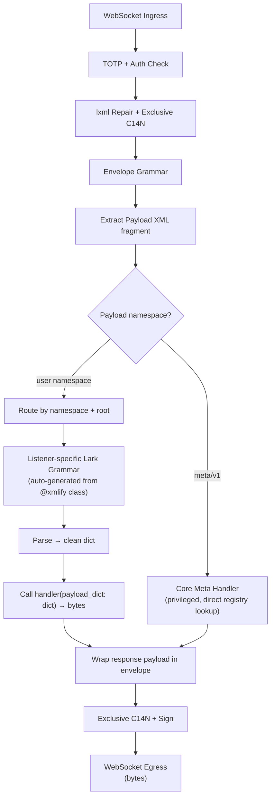

# Message Pump — End-to-End Flow

The AgentServer message pump is a single, linear, attack-resistant pipeline. Every message — local or remote, request or response — follows exactly the same path.

## Detailed Stages

1. **Ingress:** Raw bytes over WSS.

2. **The Immune System:** Every inbound packet is converted to a Tree.

3. **Internal Routing:** Trees flow between organs via the `dispatch` method.

4. **The Thought Stream (Egress):** Listeners return raw bytes. These are wrapped in a `<dummy/>` tag and run through a recovery parser.

5. **Multi-Message Extraction:** Every `<message/>` found in the dummy tag is extracted as a Tree and re-injected into the Bus.

6. **Routing Decision**
   - `https://xml-platform.org/meta/v1` → **Core Meta Handler** (privileged, internal).  
     No user listener involved. Direct registry lookup for `request-schema`, `request-example`, `request-prompt`, `list-capabilities`.
   - Any other namespace → **User Listener** lookup by `(namespace, root_element)`.

7. **Payload Validation & Conversion**  
   Listener-specific Lark grammar (auto-generated from `@xmlify` payload_class at registration).  
   One-pass, noise-tolerant parse → Transformer → guaranteed clean `dict[str, Any]`.

8. **Handler Execution**  
   Pure callable: `handler(payload_dict) -> bytes`  
   Returns raw response payload XML fragment.  
   Synchronous by default (async supported).

9. **Response Envelope**  
   Bus wraps handler bytes in standard response envelope.

10. **Egress Canonicalization**  
    Same exclusive C14N + optional signing.

11. **WebSocket Out**  
    Bytes to peer.

## Safety Properties

- **No entity expansion** anywhere (lxml parsers hardened).
- **Bounded depth/recursion** by schema design + size limits.
- **No XML trees escape the pump** — only clean dicts reach handlers.
- **Topology privacy** — normal flows reveal no upstream schemas unless meta privilege granted.
- **Zero tool-call convention** — the payload *is* the structured invocation.

The pump is deliberately simple: one path, no branches except the privileged meta shortcut. Everything else is data-driven by live, auto-generated grammars.

XML in → XML out. Safely. Permanently.
